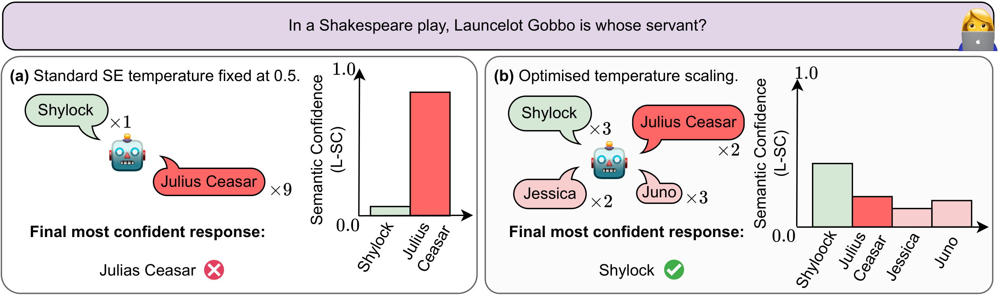
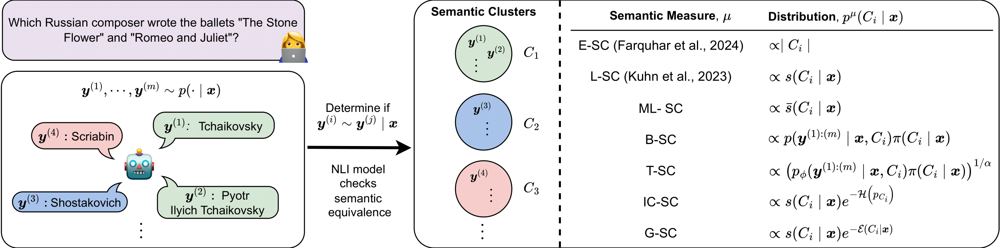
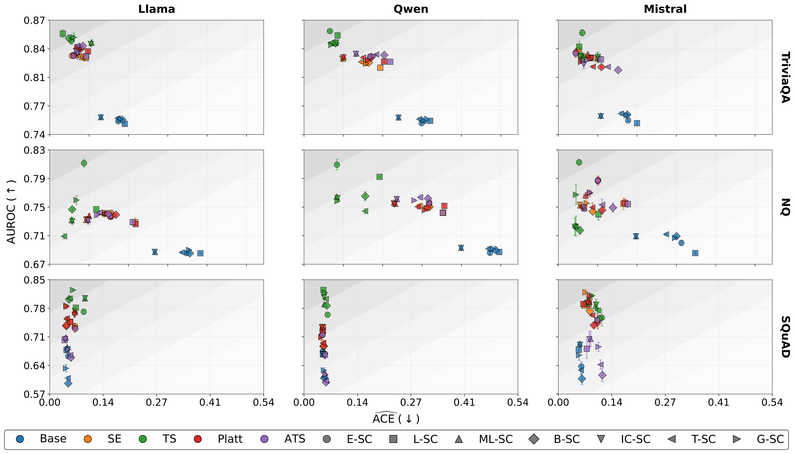

# Improving Semantic Uncertainty Quantification in Language Models via Token-Level Temperature Scaling

## Abstract

Calibration is central to reliable semantic uncertainty quantification in language models, yet prior work has largely focused on the discriminative use of semantic uncertainty, neglecting calibration. In this paper, we address this gap in the literature and study both semantic calibration and discrimination across a broad set of semantic confidence measures. We conduct a careful empirical evaluation and find that optimising a single, token-level temperature parameter is a simple and effective method for improving semantic uncertainty quantification. Across semantic confidence measures, models, and QA datasets, token-level temperature optimisation consistently improves semantic calibration, discrimination, and semantic entropy. Notably, uncertainty-focused temperature optimisation outperforms both widely-used fixed-temperature baselines and more sophisticated calibration methods for semantic uncertainty quantification.

### Motivation 



**Temperature Scaling Improves Semantic Uncertainty Quantification.** We compare the same base model with different temperature parameters, each generating ten responses for the same input, and cluster responses into semantic groups. We compute the semantic confidence measure introdcued by Kuhn et al. (2023). Panel (a) uses the recommended temperature of 0.5. Panel (b) uses a temperature optimized on a calibration set. Optimised temperature scaling offers a simple way to improve both semantic calibration and discrimination.

### Semantic Confidence Measures 



We evaluate the calibration and discrimination of semantic confidence measures across multiple question-answering datasets, including TriviaQA, Natural Questions, and SQuAD, using popular instruction-tuned language models. To investigate the effect of optimising temperature parameters (**Temperature Scaling (TS)**) on semantic uncertainty quantification, we compare against several baseline post-hoc, token-level recalibration techniques: an **Adaptive Temperature Scaling (ATS)** head that predicts token-specific temperatures, **Platt Scaling** with a diagonal affine logit transform, and fixed-temperature baselines of τ = 1.0 (Base) and τ = 0.5 (SE). We compare how each method influences semantic calibration, discrimination, and uncertainty across existing and novel semantic confidence measures.

### Main Results



Optimised **Temperature Scaling (TS)** consistently improves semantic uncertainty quantification, outperforming both fixed-temperature heuristics (Base and SE) used in prior work, and more complex calibration methods such as **Adaptive Temperature Scaling (ATS)** and **Platt Scaling**. Improvements hold across all question-answering datasets, demonstrating that TS provides a simple, robust, and effective means of enhancing both **semantic calibration** and **discrimination** of semantic confidence measures.

## Quick start

Requirements: Python 3.10+, PyTorch and dependencies listed in `requirements.txt`. Create and activate a virtual environment and install dependencies:

```bash
python3 -m venv env
source env/bin/activate
pip install -r requirements.txt
```

Run a short help check for the head training script:

```bash
python3 src/head_temp_training.py --help
```

## Reproducing key results

1. Prepare dataset(s) and update paths in `configs/`.
2. Train calibration head (token-level) with `src/head_temp_training.py`.
3. Evaluate calibration using scripts in `plotting/` and `src/utils/`.

